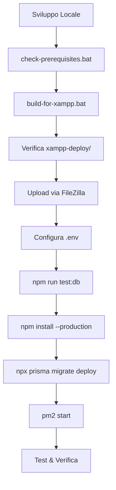

# Riepilogo File per Deployment XAMPP

Questa è la lista completa dei file creati/modificati per il deployment su XAMPP.

## 📁 File di Configurazione

### Backend

| File | Descrizione |
|------|-------------|
| `backend/prisma/schema.prisma` | ✏️ Modificato - Configurato per MySQL invece di PostgreSQL |
| `backend/.env.xampp` | ✨ Nuovo - Template configurazione environment per XAMPP |
| `backend/.htaccess` | ✨ Nuovo - Configurazione Apache per reverse proxy |
| `backend/package.json` | ✏️ Modificato - Aggiunto script `test:db` e dipendenza `mysql2` |
| `backend/src/index.ts` | ✏️ Modificato - Aggiunti domini licenzeoriginali.com ai CORS |
| `backend/test-db-connection.js` | ✨ Nuovo - Script per testare connessione MySQL |
| `backend/prisma/init-roles.sql` | ✨ Nuovo - SQL per inizializzare ruoli di sistema |

### Frontend

| File | Descrizione |
|------|-------------|
| `frontend/vite.config.ts` | ✏️ Modificato - Configurato base path `/planora/` e build ottimizzato |
| `frontend/.htaccess` | ✨ Nuovo - Configurazione Apache per React Router |
| `frontend/src/config/api.xampp.ts` | ✨ Nuovo - Configurazione API per deployment XAMPP |

## 📜 Script di Build

| File | Descrizione |
|------|-------------|
| `build-for-xampp.bat` | ✨ Nuovo - Script build automatico per Windows |
| `build-for-xampp.sh` | ✨ Nuovo - Script build automatico per Linux/Mac |
| `check-prerequisites.bat` | ✨ Nuovo - Script verifica prerequisiti |

## 📖 Documentazione

| File | Tipo | Descrizione |
|------|------|-------------|
| `README-XAMPP.md` | Documentazione | README principale per XAMPP deployment |
| `QUICK-START-XAMPP.md` | Guida rapida | 5 passi per deployment veloce |
| `XAMPP-DEPLOYMENT-GUIDE.md` | Guida completa | Guida dettagliata passo-passo (11 sezioni) |
| `DEPLOYMENT-CHECKLIST.md` | Checklist | Lista completa di controllo deployment |
| `FAQ-XAMPP.md` | FAQ | Domande frequenti e troubleshooting |
| `FILES-SUMMARY.md` | Riepilogo | Questo file - riepilogo file creati |

## ⚙️ Configurazioni Server

| File | Descrizione |
|------|-------------|
| `apache-config-example.conf` | ✨ Nuovo - Configurazione Apache VirtualHost di esempio |

## 📊 Totale File

- **File Nuovi**: 16
- **File Modificati**: 4
- **Totale**: 20 file

## 🗂️ Struttura Output Build

Dopo aver eseguito `build-for-xampp.bat`, verrà creata questa struttura:

```
xampp-deploy/
├── frontend/
│   ├── index.html
│   ├── assets/
│   │   ├── index-[hash].js
│   │   ├── index-[hash].css
│   │   └── ...
│   └── .htaccess
│
└── backend/
    ├── dist/
    │   ├── index.js
    │   ├── routes/
    │   └── ...
    ├── prisma/
    │   ├── schema.prisma
    │   └── migrations/
    ├── uploads/
    │   ├── documents/
    │   └── preventivi/
    ├── package.json
    ├── package-lock.json
    ├── .env.example
    └── .htaccess
```

## 🚀 Come Usare i File

### 1. Prima del Build

```bash
# Verifica prerequisiti
check-prerequisites.bat
```

### 2. Build Progetto

```bash
# Windows
build-for-xampp.bat

# Linux/Mac
chmod +x build-for-xampp.sh
./build-for-xampp.sh
```

### 3. Dopo il Build

La cartella `xampp-deploy/` conterrà tutto il necessario per il deployment.

### 4. Sul Server

1. **Carica i file** con FileZilla
2. **Configura .env** usando `.env.xampp` come template
3. **Testa database** con `npm run test:db`
4. **Installa dipendenze** con `npm install --production`
5. **Esegui migrazioni** con `npx prisma migrate deploy`
6. **Avvia backend** con PM2

## 📝 Modifiche Principali

### Prisma Schema

```prisma
// Prima (PostgreSQL)
datasource db {
  provider = "postgresql"
  url      = env("DATABASE_URL")
}

// Dopo (MySQL)
datasource db {
  provider = "mysql"
  url      = env("DATABASE_URL")
  relationMode = "prisma"
}
```

### Vite Config

```typescript
// Aggiunto
export default defineConfig({
  base: '/planora/',  // Per servire da sottocartella
  build: {
    // Configurazioni di build ottimizzate
  }
})
```

### Backend CORS

```typescript
// Aggiunti domini
const ALLOWED_ORIGINS = [
  // ...altri domini...
  "https://www.licenzeoriginali.com",
  "http://www.licenzeoriginali.com",
  "https://licenzeoriginali.com",
  "http://licenzeoriginali.com",
]
```

## ⚠️ File da NON Caricare

**Non caricare mai questi file/cartelle sul server:**

- ❌ `node_modules/` (frontend e backend)
- ❌ `.git/`
- ❌ `*.log`
- ❌ `.env` (carica solo `.env.example` e rinominalo)
- ❌ `.DS_Store` (Mac)
- ❌ `Thumbs.db` (Windows)

## ✅ File Essenziali per il Server

**Questi file DEVONO essere presenti sul server:**

### Frontend
- ✅ `index.html`
- ✅ `assets/` (cartella completa)
- ✅ `.htaccess`

### Backend
- ✅ `dist/` (cartella completa)
- ✅ `prisma/` (cartella completa)
- ✅ `package.json`
- ✅ `.env` (creato da `.env.example`)
- ✅ `uploads/` (struttura cartelle)

## 🔐 File Sensibili

**Questi file contengono informazioni sensibili:**

- 🔐 `backend/.env` - NON committare su Git
- 🔐 `backend/.env.xampp` - Template, rimuovi dati reali prima di committare
- 🔐 Database backup files (*.sql)

## 📦 Dipendenze Importanti Aggiunte

### Backend

```json
{
  "dependencies": {
    "mysql2": "^3.11.5"  // Driver MySQL per test-db-connection.js
  },
  "scripts": {
    "test:db": "node test-db-connection.js"  // Test connessione DB
  }
}
```

## 🧪 Test Files

| File | Comando | Descrizione |
|------|---------|-------------|
| `test-db-connection.js` | `npm run test:db` | Testa connessione MySQL |
| `check-prerequisites.bat` | `./check-prerequisites.bat` | Verifica Node.js, npm, ecc. |

## 📚 Ordine di Lettura Consigliato

Per deployment completo, leggi i file in questo ordine:

1. **README-XAMPP.md** - Overview generale
2. **QUICK-START-XAMPP.md** - Primi 5 passi
3. **DEPLOYMENT-CHECKLIST.md** - Segui la checklist
4. **XAMPP-DEPLOYMENT-GUIDE.md** - Per dettagli e approfondimenti
5. **FAQ-XAMPP.md** - In caso di problemi

## 🔄 Workflow Completo



## 📞 Supporto

Per problemi con qualsiasi file:

1. Controlla la sezione corrispondente in **XAMPP-DEPLOYMENT-GUIDE.md**
2. Cerca in **FAQ-XAMPP.md**
3. Verifica i log:
   - Browser: F12 > Console
   - Backend: `pm2 logs planora-api`
   - Apache: `/var/log/apache2/error.log`

## 🎯 Next Steps

Dopo aver letto questo riepilogo:

1. ✅ Esegui `check-prerequisites.bat`
2. ✅ Esegui `build-for-xampp.bat`
3. ✅ Segui **QUICK-START-XAMPP.md**
4. ✅ Usa **DEPLOYMENT-CHECKLIST.md** come guida

---

**Tutti i file sono pronti!** Puoi procedere con il deployment. 🚀

Legenda:
- ✨ = File nuovo creato
- ✏️ = File modificato
- 🔐 = File sensibile
- ✅ = Necessario
- ❌ = Non caricare
